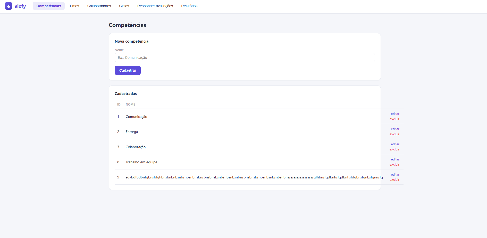

# BUG-001 - Quebra de Layout ao Cadastrar Competência com Nome Extenso

## Identificação

* ID: BUG-001
* Módulo: Competências
* Severidade: Média
* Prioridade: Média

## Título

Quebra de layout na listagem de competências ao cadastrar nome com quantidade excessiva de caracteres.

## Ambiente

* Aplicação: Avaliação de Desempenho
* Navegador: Chrome
* Data: 18/06/2026

## Pré-condição

Possuir acesso ao módulo Competências.

## Passos para Reprodução

1. Acessar o módulo Competências.
2. Informar um nome extremamente longo (sem espaços).
3. Clicar em "Cadastrar".
4. Observar a listagem de competências.

## Resultado Atual

O texto excede o espaço disponível da tabela, causando quebra de layout e prejudicando a visualização das ações "editar" e "excluir".

## Resultado Esperado

O sistema deve tratar textos extensos adequadamente, por exemplo:

* Aplicando quebra de linha;
* Aplicando truncamento com reticências (...);
* Limitando a quantidade máxima de caracteres permitidos;
* Mantendo a integridade visual da tabela.

## Impacto

A interface perde legibilidade e a experiência do usuário é prejudicada ao visualizar ou gerenciar competências com nomes extensos.

## Evidência

