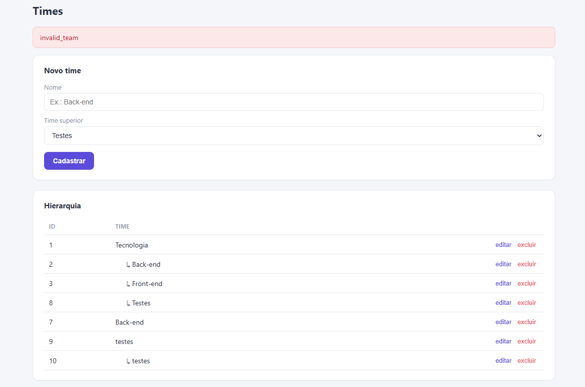

# BUG-002 - Mensagem de erro técnica exibida ao usuário

## Módulo
Times

## Severidade
Média

## Prioridade
Média

## Título
Sistema exibe código técnico de erro ao invés de mensagem amigável ao usuário.

## Passos para Reprodução
1. Acessar o módulo Times.
2. Informar dados que gerem erro de validação.
3. Clicar em "Cadastrar".

## Resultado Atual
O sistema exibe a mensagem:

"invalid_team"

## Resultado Esperado
O sistema deve exibir uma mensagem compreensível para o usuário, por exemplo:

- "Nome é obrigatório."
- "O time superior informado não é válido."
- "Não é possível criar uma hierarquia cíclica."

## Impacto
A mensagem não orienta o usuário sobre o problema encontrado, dificultando a correção dos dados informados.

## Evidência

