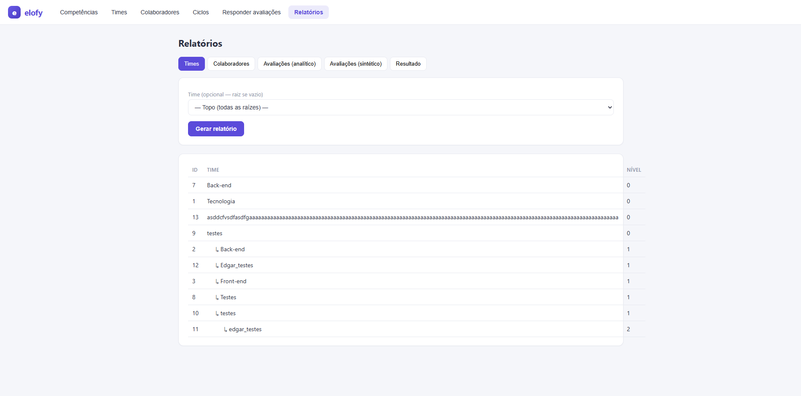
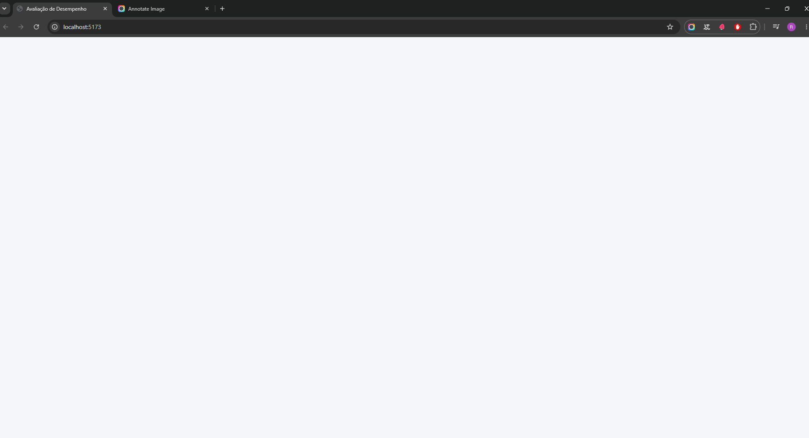

# BUG-003 - Tela branca ao acessar Avaliações Sintético após gerar relatório

## Módulo
Relatórios / Avaliações Sintético

## Severidade
Alta

## Prioridade
Alta

## Título
Sistema apresenta tela totalmente branca ao acessar a página Avaliações Sintético após geração de relatório na aba Times.

## Passos para Reprodução
1. Acessar o módulo **Relatórios**.
2. Navegar até a aba **Times**.
3. Gerar um relatório.
4. Após finalizar a geração do relatório, acessar a página **Avaliações Sintético**.
5. Observar o carregamento da página.

## Resultado Atual
Ao acessar a página **Avaliações Sintético**, após gerar um relatório em **Relatórios > Times**, os elementos da tela não são carregados e o sistema apresenta uma página totalmente branca.

## Resultado Esperado
O sistema deve carregar normalmente a página **Avaliações Sintético**, exibindo todos os componentes, informações e funcionalidades disponíveis para o usuário.

## Impacto
O usuário fica impossibilitado de visualizar e utilizar a página de Avaliações Sintético após realizar o fluxo de geração de relatório, prejudicando a navegação e utilização da funcionalidade.

## Evidência

