# Execução dos Testes

## Resumo da Execução

| ID | Funcionalidade | Status |
|----|---------------|---------|
| CT-001 | Competências | A Executar |
| CT-002 | Competências | A Executar |
| CT-003 | Times | A Executar |
| CT-004 | Times | A Executar |
| CT-005 | Colaboradores | A Executar |
| CT-006 | Colaboradores | A Executar |
| CT-007 | Ciclos | A Executar |
| CT-008 | Ciclos | A Executar |
| CT-009 | Ciclos | A Executar |
| CT-010 | Ciclos | A Executar |
| CT-011 | Avaliações | A Executar |
| CT-012 | Avaliações | A Executar |
| BUG-001 | Defeito Encontrado | Aberto |

---

# Competências

## CT-001 - Criar Competência Válida

**Objetivo:** Validar criação de competência com dados válidos.

### Passos
1. Acessar o módulo Competências.
2. Informar um nome válido.
3. Salvar o cadastro.

### Resultado Esperado
- Competência criada com sucesso.
- Registro exibido na listagem.

### Evidência

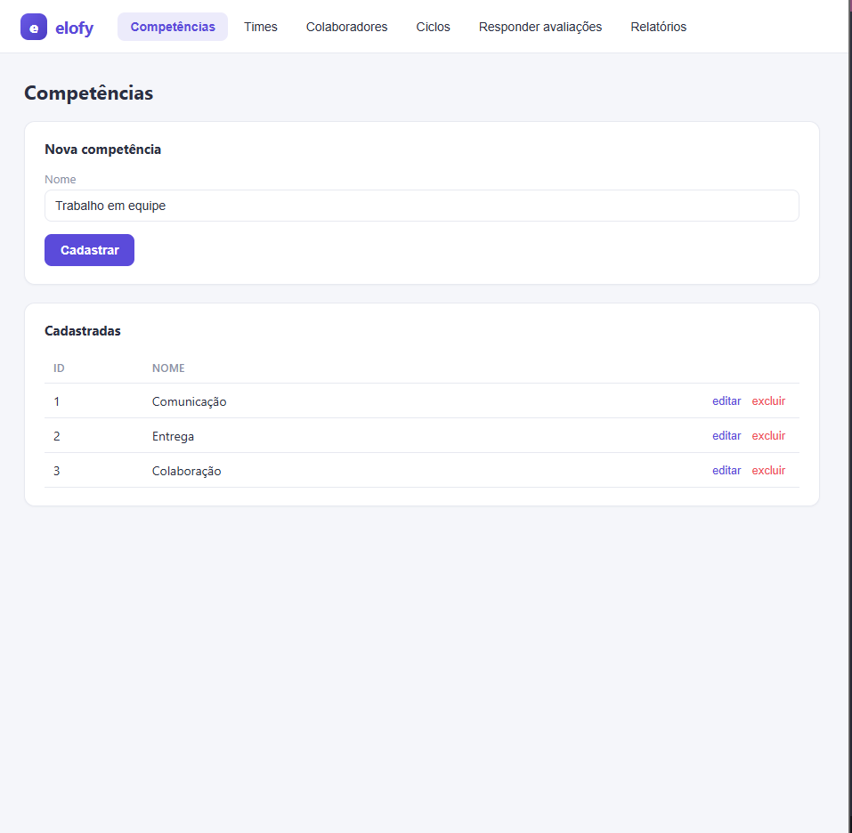---
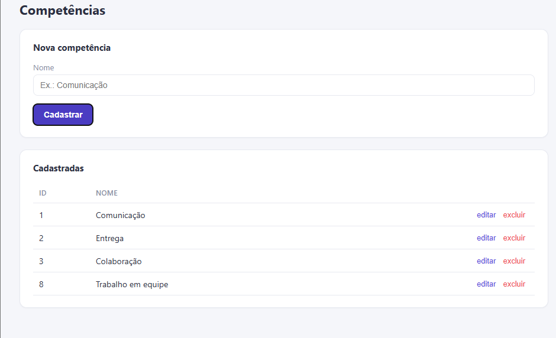---

## CT-002 - Criar Competência Sem Nome

**Objetivo:** Validar obrigatoriedade do campo nome.

### Passos
1. Acessar o módulo Competências.
2. Deixar o campo Nome vazio.
3. Salvar.

### Resultado Esperado
- Sistema impede o cadastro.
- Mensagem de validação exibida.

### Evidência
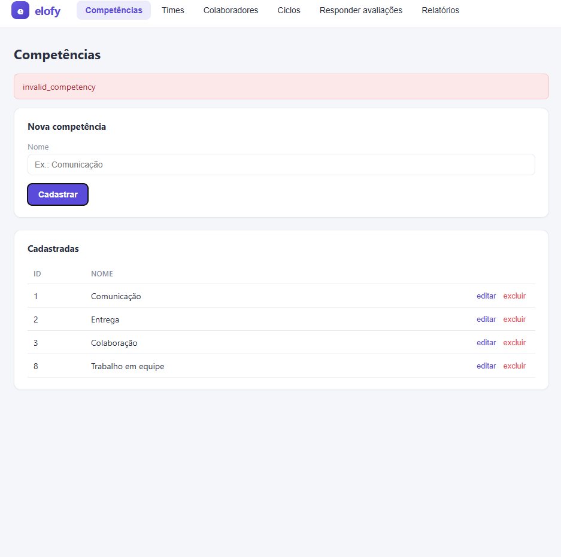---
---

# Times

## CT-003 - Criar Time Sem Hierarquia

**Objetivo:** Validar criação de time sem time superior.

### Passos
1. Acessar o módulo Times.
2. Informar um nome válido.
3. Não selecionar time superior.
4. Salvar.

### Resultado Esperado
- Time criado com sucesso.

### Evidência
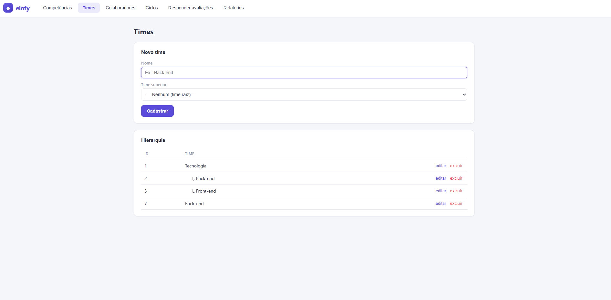---
---

## CT-004 - Criar Time Filho

**Objetivo:** Validar relacionamento hierárquico entre times.

### Passos
1. Acessar o módulo Times.
2. Informar um nome válido.
3. Selecionar um time superior.
4. Salvar.

### Resultado Esperado
- Time criado corretamente.
- Hierarquia exibida corretamente.

### Evidência

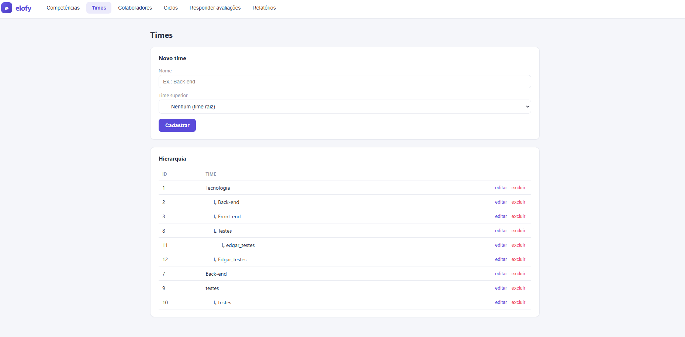---
---

# Colaboradores

## CT-005 - Criar Colaborador Sem Gestor

**Objetivo:** Validar cadastro básico de colaborador.

### Passos
1. Acessar o módulo Colaboradores.
2. Informar nome válido.
3. Selecionar um time.
4. Salvar.

### Resultado Esperado
- Colaborador criado com sucesso.

### Evidência
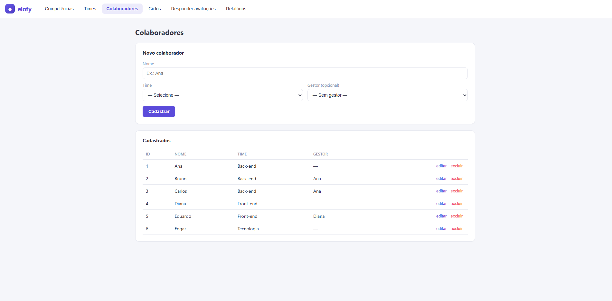---

---

## CT-006 - Criar Colaborador Com Gestor

**Objetivo:** Validar vínculo de colaborador com gestor.

### Passos
1. Acessar o módulo Colaboradores.
2. Informar nome válido.
3. Selecionar um time.
4. Selecionar um gestor.
5. Salvar.

### Resultado Esperado
- Colaborador criado com sucesso.
- Gestor vinculado corretamente.

### Evidência
---

---

# Ciclos

## CT-007 - Criar Ciclo Válido

**Objetivo:** Validar criação de ciclo com dados válidos.

### Passos
1. Acessar o módulo Ciclos.
2. Informar nome.
3. Informar período válido.
4. Selecionar times.
5. Selecionar competências.
6. Salvar.

### Resultado Esperado
- Ciclo criado em status Draft.

### Evidência
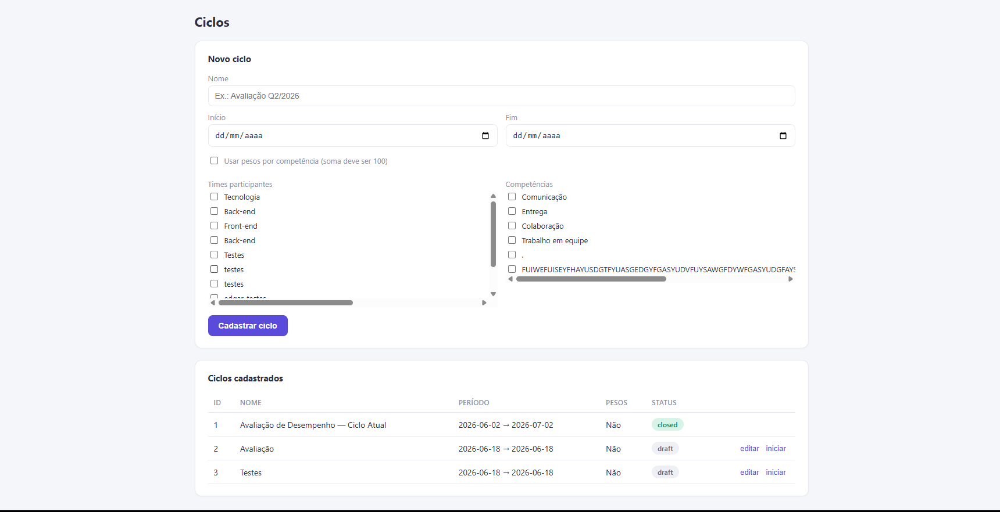---
---

## CT-008 - Criar Ciclo Com Data Inicial Maior Que Data Final

**Objetivo:** Validar regra de consistência das datas.

### Passos
1. Acessar o módulo Ciclos.
2. Informar data inicial posterior à data final.
3. Salvar.

### Resultado Esperado
- Sistema impede a criação.
- Mensagem de validação exibida.

### Evidência
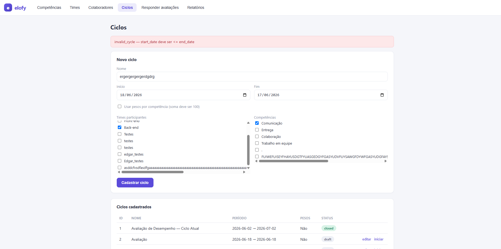---

---

## CT-009 - Ativar Ciclo Válido

**Objetivo:** Validar ativação do ciclo.

### Passos
1. Criar ou selecionar um ciclo Draft.
2. Clicar em Iniciar Ciclo.

### Resultado Esperado
- Status alterado para Active.
- Avaliações geradas automaticamente.

### Evidência
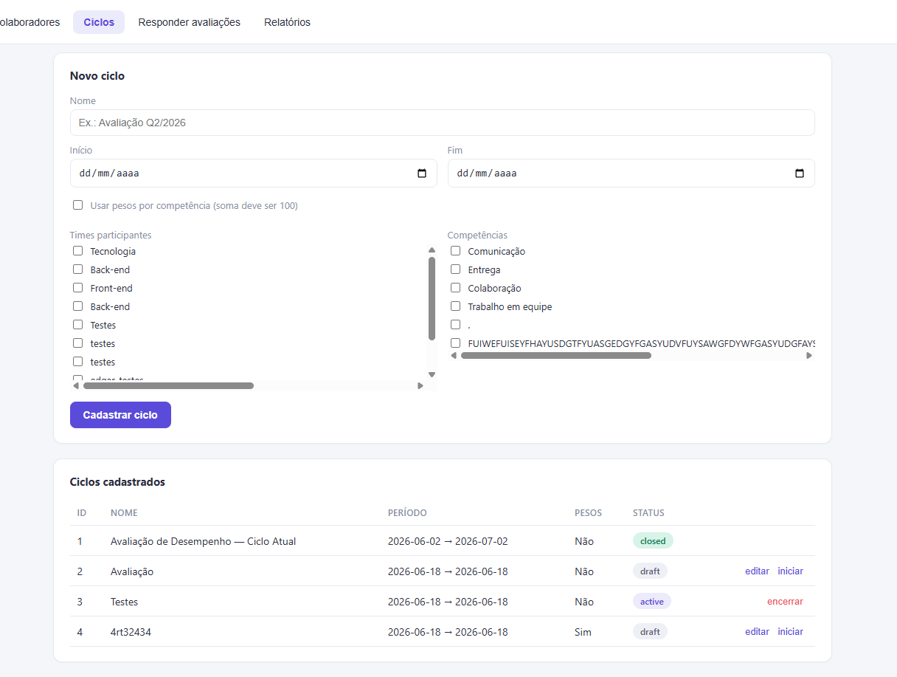---

---

## CT-010 - Validar Regra Dos Pesos

**Objetivo:** Validar regra de soma dos pesos.

### Passos
1. Criar ciclo com pesos habilitados.
2. Configurar pesos cuja soma seja diferente de 100.
3. Tentar iniciar o ciclo.

### Resultado Esperado
- Sistema impede ativação.
- Exibe mensagem informando erro na soma dos pesos.

### Evidência
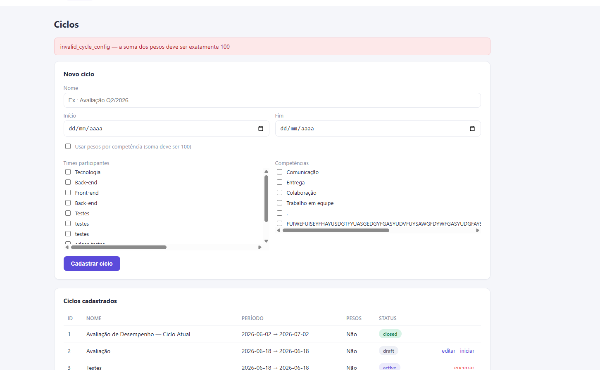---

---

# Avaliações

## CT-011 - Responder Avaliação Válida

**Objetivo:** Validar preenchimento completo da avaliação.

### Passos
1. Acessar uma avaliação disponível.
2. Informar notas válidas para todas as competências.
3. Salvar.

### Resultado Esperado
- Avaliação concluída.
- Status alterado para Completed.

### Evidência
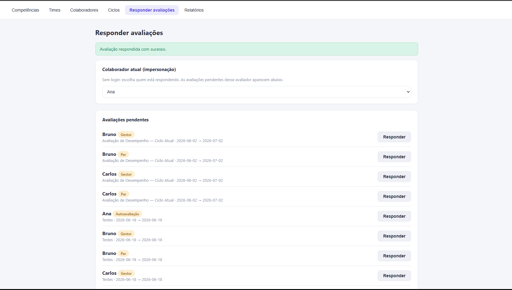---
---

## CT-012 - Responder Avaliação Com Nota Inválida

**Objetivo:** Validar faixa permitida das notas.

### Passos
1. Acessar uma avaliação.
2. Informar nota fora da faixa permitida.
3. Salvar.

### Resultado Esperado
- Sistema impede envio.
- Exibe mensagem de erro.

### Evidência
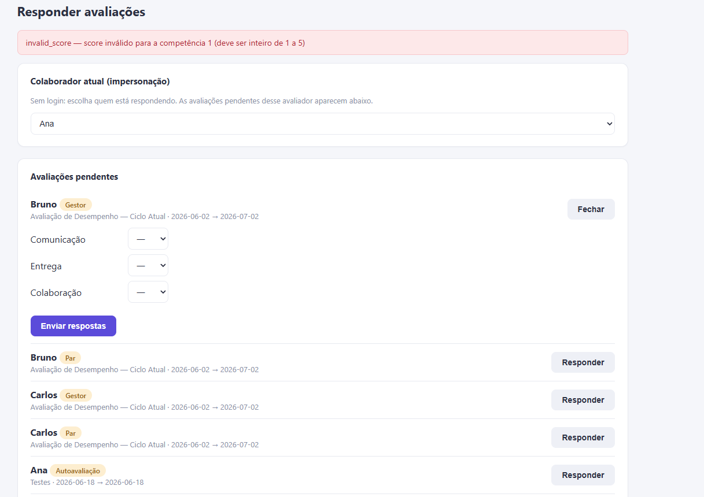---
---

