# Execução dos Testes de API

## Resumo da Execução

| ID | Endpoint | Cenário | Status |
|------|----------|----------|----------|
| CT-API-001 | GET /health | Health Check | Executado |
| CT-API-002 | POST /competencies | Criar Competência | Executado |
| CT-API-003 | POST /teams | Criar Time | Executado |
| CT-API-004 | POST /employees | Criar Colaborador | Executado |
| CT-API-005 | GET /competencies | Listar Competências | Executado |
| CT-API-006 | POST /cycles | Criar Ciclo | Executado |
| CT-API-007 | POST /cycles/:id/start | Iniciar Ciclo | Executado |
| CT-API-007N1 | POST /cycles/:id/start | Iniciar Ciclo Já Ativo | Executado |
| CT-API-008 | GET /evaluations | Listar Avaliações | Executado |
| CT-API-009 | POST /evaluations/:id/answer | Responder Avaliação | Executado |
| CT-API-009N1 | POST /evaluations/:id/answer | Responder Avaliação Já Respondida | Executado |
| CT-API-010 | GET /reports/analytic | Relatório Analítico | Executado |
| CT-API-011 | GET /reports/summary | Relatório Sintético | Executado |
| CT-API-012 | GET /reports/results | Relatório de Resultados | Executado |

---

# Health Check

## CT-API-001 - Validar Disponibilidade da API

**Objetivo:** Validar que a API está disponível e respondendo corretamente.

### Requisição

```http
GET /api/health
```

### Resultado Esperado

- Status Code 200.
- API disponível para consumo.
- Corpo da resposta retornado corretamente.

### Evidência

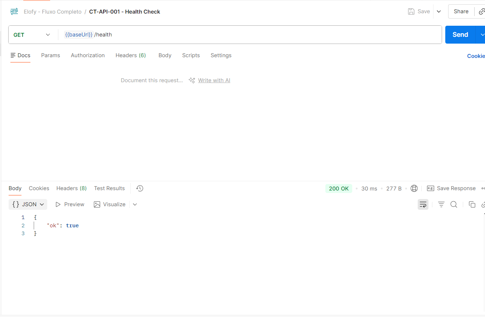

---

# Competências

## CT-API-002 - Criar Competência

**Objetivo:** Validar criação de competência com dados válidos.

### Requisição

```http
POST /api/competencies
```

### Payload

```json
{
  "name": "Liderança"
}
```

### Resultado Esperado

- Status Code 201.
- Competência criada com sucesso.
- Retorno contendo identificador da competência.

### Validações

- Campo `id` preenchido.
- Campo `name` igual ao enviado na requisição.

### Evidência

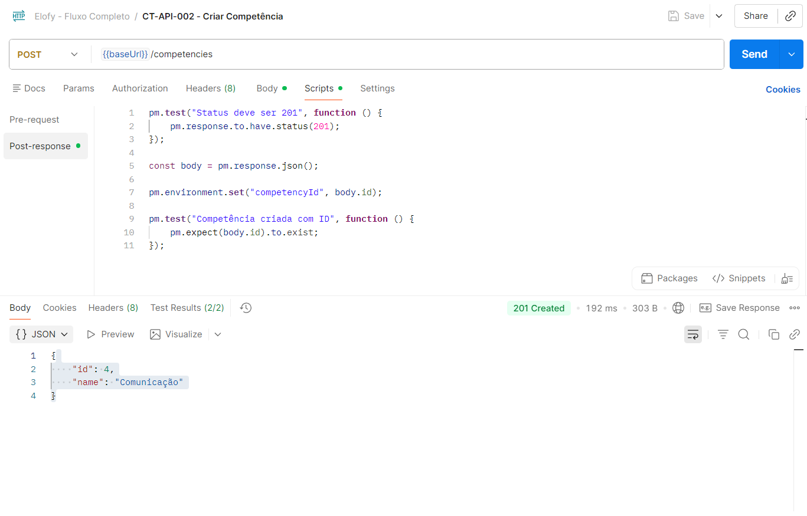

---

## CT-API-005 - Listar Competências

**Objetivo:** Validar retorno da listagem de competências.

### Requisição

```http
GET /api/competencies
```

### Resultado Esperado

- Status Code 200.
- Lista de competências retornada.
- Competência criada anteriormente presente na resposta.

### Evidência

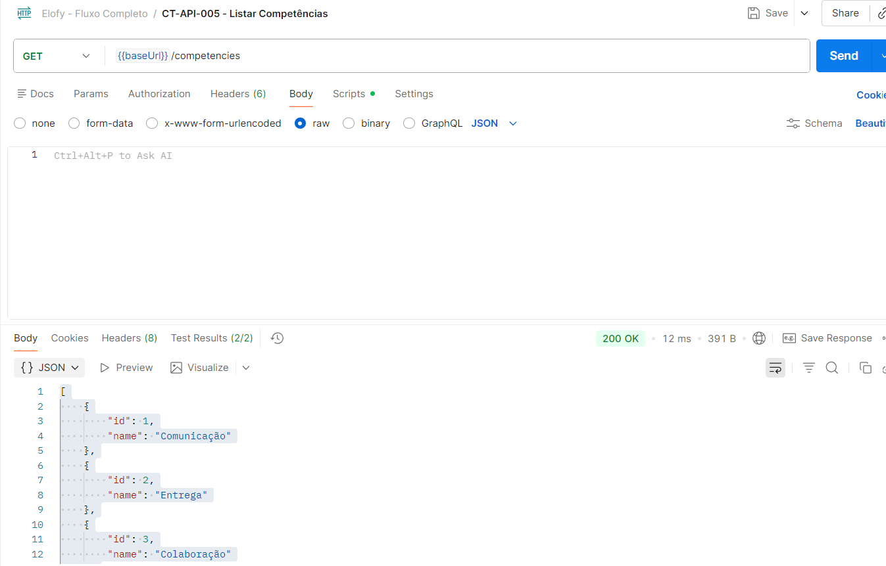

---

# Times

## CT-API-003 - Criar Time

**Objetivo:** Validar criação de time com dados válidos.

### Requisição

```http
POST /api/teams
```

### Payload

```json
{
  "name": "QA"
}
```

### Resultado Esperado

- Status Code 201.
- Time criado com sucesso.

### Validações

- Campo `id` preenchido.
- Campo `name` igual ao enviado.

### Evidência

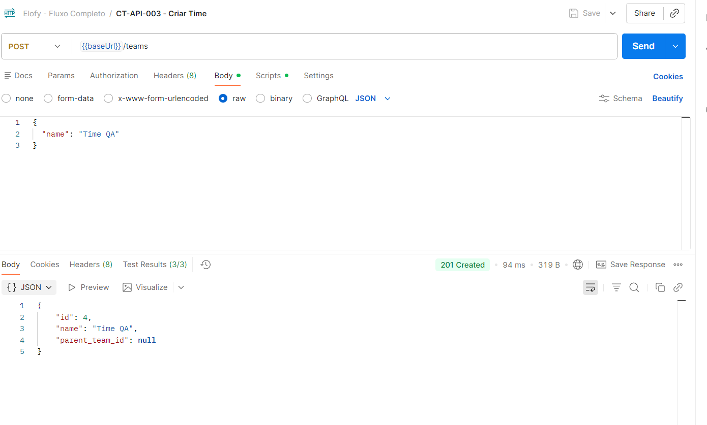

---

# Colaboradores

## CT-API-004 - Criar Colaborador

**Objetivo:** Validar criação de colaborador vinculado a um time.

### Requisição

```http
POST /api/employees
```

### Payload

```json
{
  "name": "João Teste",
  "team_id": 5
}
```

### Resultado Esperado

- Status Code 201.
- Colaborador criado com sucesso.
- Relacionamento com time salvo corretamente.

### Evidência

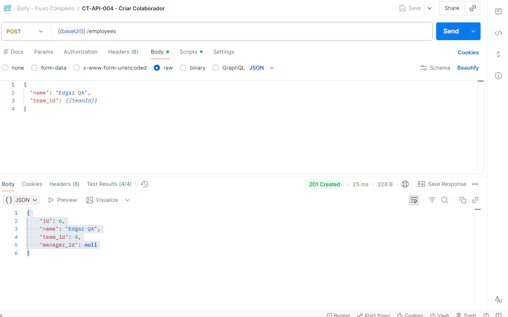

---

# Ciclos

## CT-API-006 - Criar Ciclo

**Objetivo:** Validar criação de ciclo com configuração válida.

### Requisição

```http
POST /api/cycles
```

### Resultado Esperado

- Status Code 201.
- Ciclo criado com status `draft`.

### Validações

- Nome gravado corretamente.
- Datas gravadas corretamente.
- Competências associadas ao ciclo.
- Times associados ao ciclo.

### Evidência

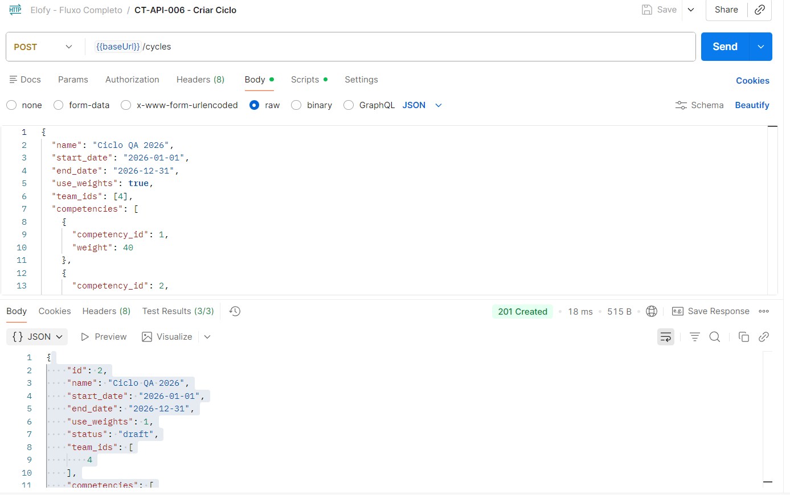

---

## CT-API-007 - Iniciar Ciclo

**Objetivo:** Validar ativação do ciclo e geração automática das avaliações.

### Requisição

```http
POST /api/cycles/{id}/start
```

### Resultado Esperado

- Status Code 200.
- Status alterado para `active`.
- Avaliações geradas automaticamente.

### Exemplo de Retorno

```json
{
  "cycle_id": 1,
  "status": "active",
  "evaluations_generated": 13
}
```

### Validações

- Campo `status` igual a `active`.
- Campo `evaluations_generated` maior que zero.

### Evidência

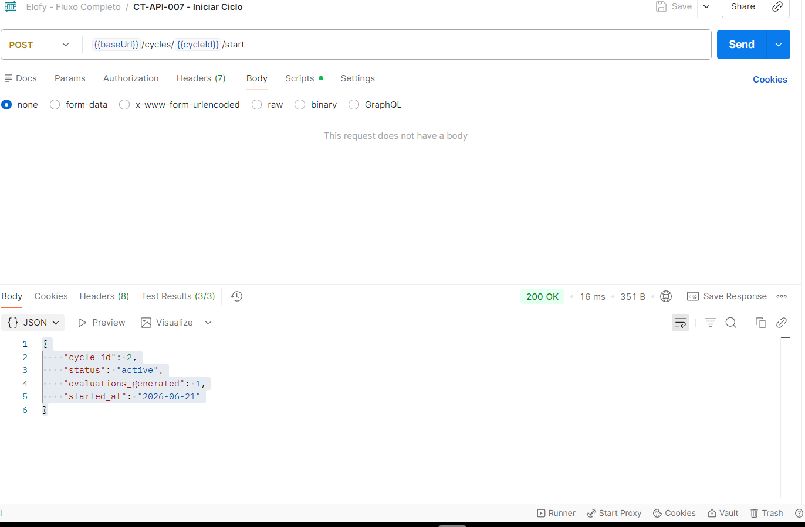

---

## CT-API-007N1 - Iniciar Ciclo Já Ativo

**Objetivo:** Validar bloqueio de reativação de ciclo.

### Requisição

```http
POST /api/cycles/{id}/start
```

### Resultado Esperado

- Status Code 409.
- Retorno do erro `cycle_already_started`.

### Exemplo de Retorno

```json
{
  "error": "cycle_already_started"
}
```

### Evidência

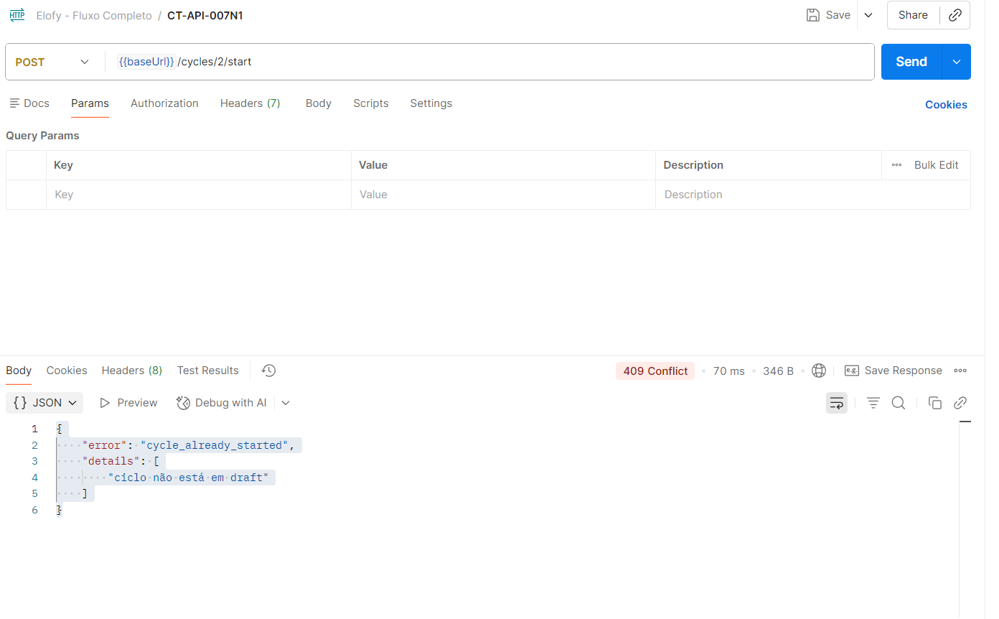

---

# Avaliações

## CT-API-008 - Listar Avaliações Geradas

**Objetivo:** Validar geração automática das avaliações após início do ciclo.

### Requisição

```http
GET /api/evaluations
```

### Resultado Esperado

- Status Code 200.
- Avaliações retornadas.
- Quantidade compatível com as regras de negócio.

### Evidência

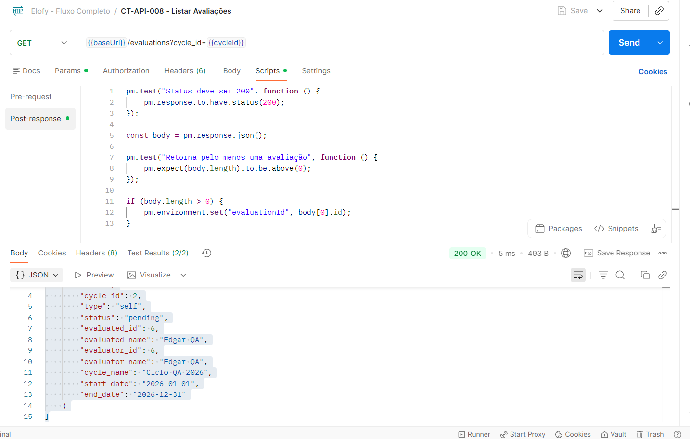

---

## CT-API-009 - Responder Avaliação

**Objetivo:** Validar preenchimento completo de uma avaliação.

### Requisição

```http
POST /api/evaluations/{id}/answer
```

### Payload

```json
{
  "evaluator_id": 2,
  "answers": [
    {
      "competency_id": 1,
      "score": 5
    },
    {
      "competency_id": 2,
      "score": 4
    },
    {
      "competency_id": 3,
      "score": 5
    }
  ]
}
```

### Resultado Esperado

- Status Code 200.
- Avaliação concluída com sucesso.

### Exemplo de Retorno

```json
{
  "evaluation_id": 101,
  "status": "completed"
}
```

### Validações

- Campo `status` igual a `completed`.
- Identificador da avaliação retornado.

### Evidência

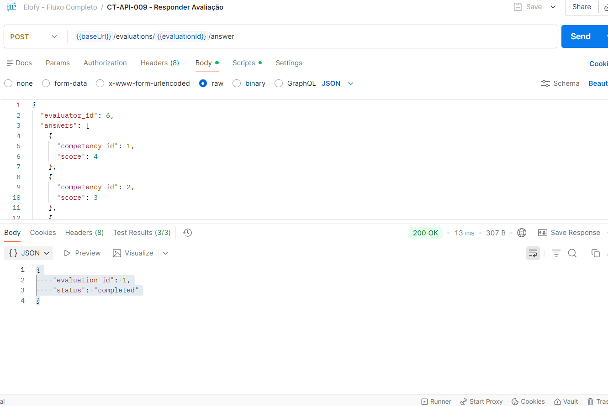

---

## CT-API-009N1 - Responder Avaliação Já Respondida

**Objetivo:** Validar bloqueio de reenvio de avaliação.

### Requisição

```http
POST /api/evaluations/{id}/answer
```

### Resultado Esperado

- Status Code 409.
- Retorno do erro `already_answered`.

### Exemplo de Retorno

```json
{
  "error": "already_answered"
}
```

### Evidência

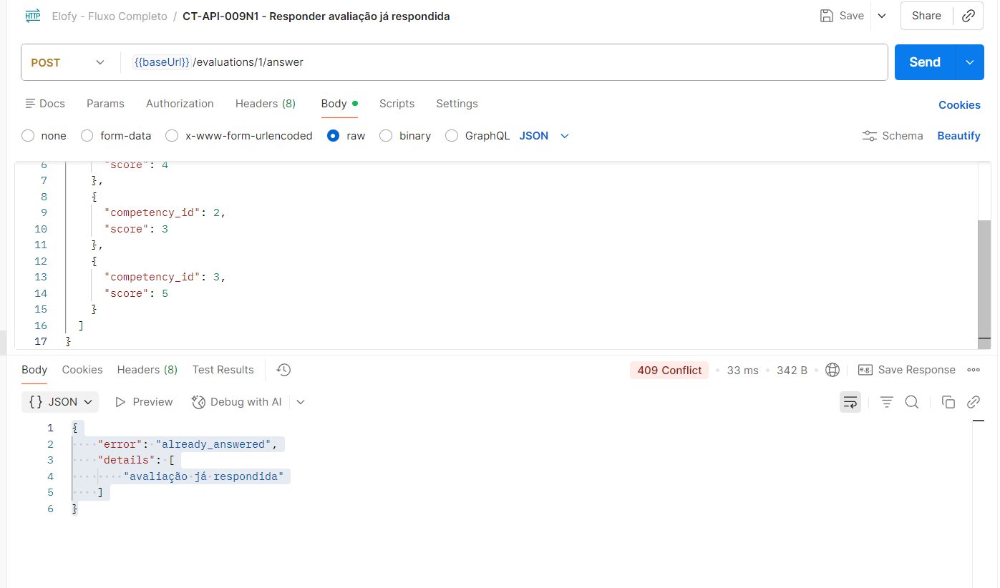

---

# Relatórios

## CT-API-010 - Consultar Relatório Analítico

**Objetivo:** Validar geração do relatório analítico.

### Requisição

```http
GET /api/reports/analytic
```

### Resultado Esperado

- Status Code 200.
- Dados analíticos retornados.
- Informações compatíveis com as avaliações registradas.

### Evidência

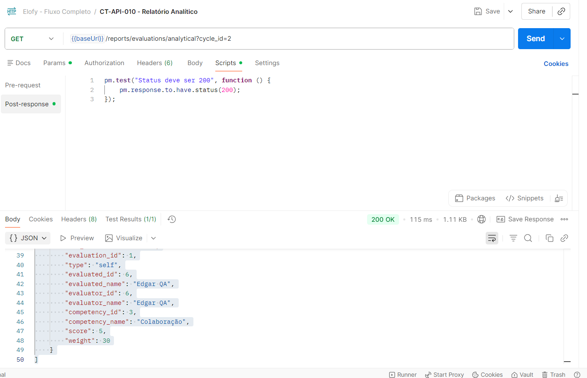

---

## CT-API-011 - Consultar Relatório Sintético

**Objetivo:** Validar geração do relatório sintético.

### Requisição

```http
GET /api/reports/summary
```

### Resultado Esperado

- Status Code 200.
- Resumo consolidado das avaliações retornado.

### Evidência

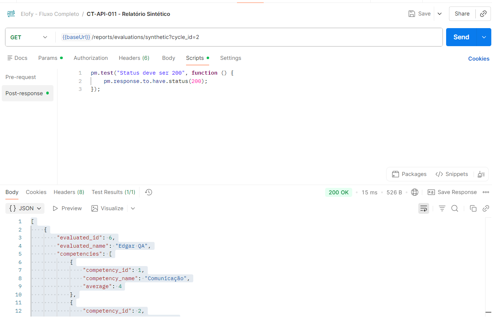

---

## CT-API-012 - Consultar Relatório de Resultados

**Objetivo:** Validar relatório final de desempenho.

### Requisição

```http
GET /api/reports/results
```

### Resultado Esperado

- Status Code 200.
- Resultado consolidado do ciclo retornado.
- Médias calculadas corretamente.

### Evidência

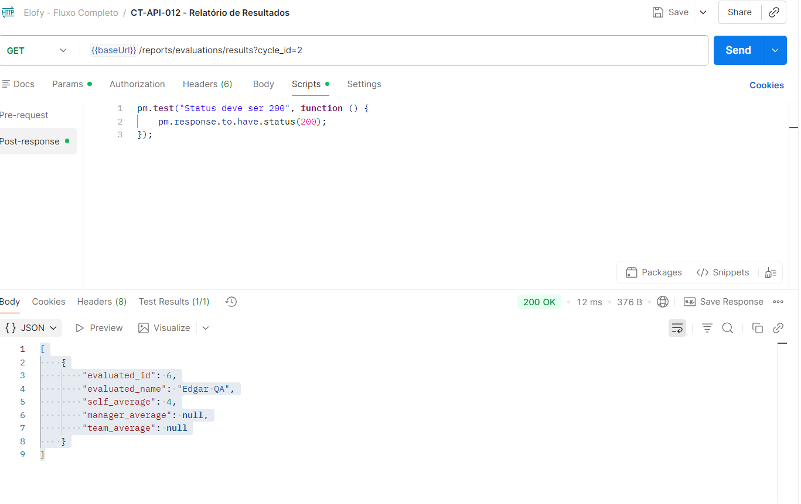

---

# Cenários Negativos Planejados

| ID | Cenário | Resultado Esperado |
|------|----------|-------------------|
| CT-API-013 | Iniciar ciclo inexistente | 404 - cycle_not_found |
| CT-API-014 | Iniciar ciclo sem competências | 422 - invalid_cycle_config |
| CT-API-015 | Iniciar ciclo sem times | 422 - invalid_cycle_config |
| CT-API-016 | Iniciar ciclo com pesos diferentes de 100 | 422 - invalid_cycle_config |
| CT-API-017 | Responder avaliação com nota menor que 1 | 400 - invalid_score |
| CT-API-018 | Responder avaliação com nota maior que 5 | 400 - invalid_score |
| CT-API-019 | Responder avaliação com avaliador incorreto | 403 - forbidden |
| CT-API-020 | Responder avaliação sem todas as competências | 422 - missing_competencies |
| CT-API-021 | Responder avaliação fora do período do ciclo | 410 - cycle_expired |

---